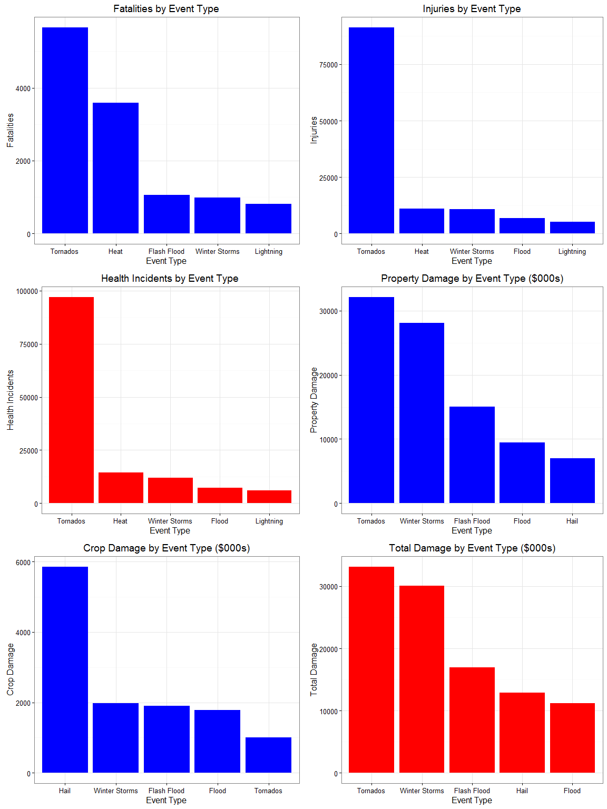
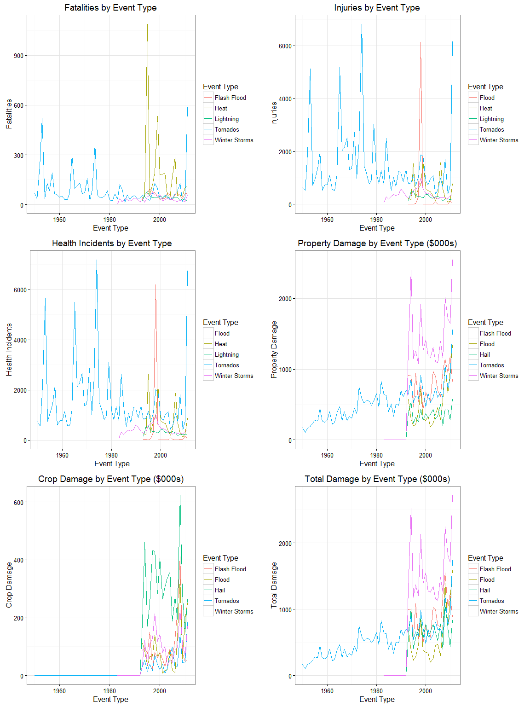
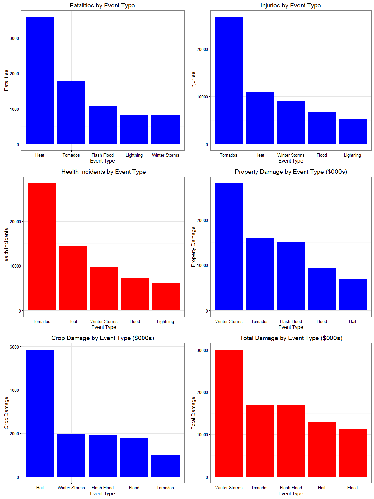

# Public Health and Economic Impact of Hydro-Meteorological Events (Storms)
John James  
March 18, 2016  


## Synopsis

Storms and other severe weather events can cause both public health and economic problems for communities and municipalities. Many severe events can result in fatalities, injuries, and property damage, and preventing such outcomes to the extent possible is a key concern.  The purpose of this project was to explore and analyze the U.S. National Oceanic and Atmospheric Administration's (NOAA) storm database to determine which types of hydro-meteorological events posed the greatest public health and economic cost.  **Tornados** initially emerged as the top driver of public health and economic problems; however, a subsequent analysis of events over time revealed a significant lack of data for the other leading event types for the period ranging from 1950 to approximately 1990.  As such, the analysis was based upon the data from 1990 to 2011.  From a public health perspective, **tornados** have generated the highest number of health incidents; however, **excessive heat** was responsible for the greatest number of weather & storm related fatalities.  From an economic standpoint, **winter storms** emerged as the most costly of the weather events.

## Research Question
The report seeks to address the following questions:

1. Across the United States, which types of events are most harmful with respect to population health?
2. Across the United States, which types of events have the greatest economic consequences?

## Raw Data 
This report analyzed the NOAA Storm Events Database which documents the occurrence of storms and other significant weather phenomena having sufficient intensity to cause loss of life, injuries, significant property damage, and/or disruption to commerce. The database currently contains data from January 1950 to November 2015, as entered by NOAA's National Weather Service (NWS), capturing fatalities, property damage, and crop damage for some 48 designated event types.

## Data Processing
### Environment Setup
The following code configures the environment for the analysis.  Filenames are designated, the directory structure is established, and the requisite files and libraries are sourced.  


```r
# Processes to run
load <- TRUE
review <- TRUE
process <- TRUE
analyze <- TRUE
present <- TRUE

# Raw Data File Parameters
dataUrl <- "https://d396qusza40orc.cloudfront.net/repdata%2Fdata%2FStormData.csv.bz2"  # Link to data source
dataZipFile <- "stormData.zip"  # Name of zip file (get this from the data source code book)
dataCsvFile <- "stormData.csv"  # Name of csv file (get this from the data source code book)
dataFrame <- "stormData"  # Name of data frame that will contain the storm data

# Directories
dataRawDir <- "Data/Raw Data/"  # Directory for raw data    
dataProcDir <- "Data/Processed Data/"  # Directory for processed data
codeDir <- "Code/"  # Directory for code
figDir <- "Figure/"  # Directory for Figures

# Load custom functions files
source(file = paste(codeDir, "load.R", sep = ""))
source(file = paste(codeDir, "review.R", sep = ""))
source(file = paste(codeDir, "process.R", sep = ""))
source(file = paste(codeDir, "analyze.R", sep = ""))
source(file = paste(codeDir, "present.R", sep = ""))

# Include requisite libraries
library(ggplot2)
library(dplyr)
library(gridExtra)
library(downloader)
```

### Load Data
This function downloads a zipped file from the web and stores it in the designated directory.  The function checks of the raw data directory exists, and creates it if it doesn't.  Next, the file is downloaded if the file doesn't exist, or the the file wasn't downloaded on the current day. Finally, we read the file into a data frame and return it to the master script.

  * Args:

    + url - the url for website from which the file will be downloaded
    + dir - the redirectory to which the file will be stored
    + zip - the name of the zip file
    + CSV - the name of the csv file
    + df  - the name of thd data frame that contains the data

  * Response: This function will load the storm data file into a data frame and return it to the calling script

```r
loadData <- function(url, dir, zip, csv, df) {
    if (missing(url)) {
        stop("Missing url for data")
    }
    if (missing(dir)) {
        stop("Directory to which the data is to be stored, must be specified")
    }
    if (missing(zip)) {
        stop("The name of the zip file must be specified")
    }
    if (missing(csv)) {
        stop("The name of the csv file must be specified")
    }
    if (missing(df)) {
        stop("The name of the data frame must be specified")
    }
    zip <- paste(dir, zip, sep = "")
    csv <- paste(dir, csv, sep = "")
    home <- getwd()
    if (!dir.exists(dir)) {
        dir.create(dir, recursive = TRUE)
    }
    today <- Sys.Date()
    mDate <- as.Date(file.info(zip)$mtime, tz = "EST")
    if ((!file.exists(zip)) | (mDate != today)) {
        download(url, dest = zip, mode = "wb")
        df <- read.csv(bzfile(zip))
    }
    df <- read.csv(bzfile(zip))
    return(df)
}
```

The function above is called here if "Load" (from environment variables) is set to TRUE

```r
if (load) {
    stormData <- loadData(dataUrl, dataRawDir, dataZipFile, dataCsvFile, dataFrame)
}
```

### Data Review
The following code provides the dimensions of the dataset, the number of unique event types, and the number of rows with zero values for each of the variables being analyzed.

```r
reviewData <- function(x) {
    if (missing(x)) {
        stop("The data frame to be reviewed must be provided")
    }
    d <- dim(x)
    e <- unique(x$EVTYPE)
    e <- length(e)
    z <- x[which(x$FATALITIES == 0 & x$INJURIES == 0 & x$PROPDMG == 0 & x$CROPDMG == 
        0), ]
    z <- dim(z)
    l <- list(d, e, z)
    return(l)
}
```


```r
if (review) {
    dataReport <- reviewData(stormData)
    observations <- dataReport[[1]][1]
    variables <- dataReport[[1]][2]
    numEventTypes <- dataReport[[2]][1]
    zeroRows <- dataReport[[3]][1]
}
```

There were **902,297** observations in the original data file, each having **37** variables.  The data set contained **985** unique event types and **647,664** rows have zero values for each of the variables being measured.


### Data Transformations
Before analyzing the data, several data transformations were undertaken. 

#### Remove Zero Rows
This statement removes rows in which the value of each of the measurement variables is zero.


```r
stormData <- stormData[which(stormData$FATALITIES != 0 | stormData$INJURIES != 
    0 | stormData$PROPDMG != 0 | stormData$CROPDMG != 0), ]
```

#### Extract Variables
The variables of interest for this analysis were:

* EVTYPE - The type of event.  The data contained 985 factor levels.
* BGN_DATE - The date upon which the weather event occurred
* FATALITIES - The number of fatalities directly caused by the weather event
* INJURIES - The number of persons injured as a direct consequence of the weather event.
* PROPDMG - The estimated amount of property damage indicated in dollar amounts adjusted by the PROPDMGEXP factor
* PROPDMGEXP - This factor indicates multiplicative factor to apply to the PROPDMG number.  For instance, a value of "K" indicates that the number in PROPDMG should be multiplied by 1000.  
* CROPDMG - The estimated amount of crop damage indicated in dollar amounts adjusted by the PROPDMGEXP factor
* CROPDMGEXP - This factor indicates multiplicative factor to apply to the CROPDMG number.  For instance, a value of "2" indicates that the number in PROPDMG should be multiplied by 100.  

The following code extracts the variables of interest for this analysis:


```r
stormData <- select(stormData, BGN_DATE, EVTYPE, FATALITIES, INJURIES, PROPDMG, 
    PROPDMGEXP, CROPDMG, CROPDMGEXP)
```

#### Event Type
There were 48 designated event types; however, there were 985 different factor levels for EVTYPE.  The following function and the associated call recodes the EVTYPE variable to one of the 48 designated values.  The designated event types are described in the NOAA Storm Data Directive NWSPD 10-16 which is available on the NOAA website at https://d396qusza40orc.cloudfront.net/repdata%2Fpeer2_doc%2Fpd01016005curr.pdf. 


```r
processEventType <- function(x) {
    x$EVTYPE = tolower(x$EVTYPE)
    x$EVTYPE[grep("low tide", x$EVTYPE)] = "Astronomical Low Tide"
    x$EVTYPE[grep("avalanche|avalanc", x$EVTYPE)] = "Avalanche"
    x$EVTYPE[grep("blizzard|snow|excessive snow", x$EVTYPE)] = "Snow"
    x$EVTYPE[grep("coastal flood|beach|erosion", x$EVTYPE)] = "Coastal Flood"
    x$EVTYPE[grep("wind chill", x$EVTYPE)] = "Cold Wind Chill"
    x$EVTYPE[grep("debris flow|rock|landslide|mud|lands", x$EVTYPE)] = "Debris Flow"
    x$EVTYPE[grep("dense fog|vog|fog", x$EVTYPE)] = "Dense Fog"
    x$EVTYPE[grep("smoke", x$EVTYPE)] = "Dense Smoke"
    x$EVTYPE[grep("drought|dry|driest", x$EVTYPE)] = "Drought"
    x$EVTYPE[grep("dust", x$EVTYPE)] = "Dust Devil/Storm"
    x$EVTYPE[grep("heat|high temp|warmth|hot|high|warm|record high|record temp", 
        x$EVTYPE)] = "Heat"
    x$EVTYPE[grep("lakeshore flood", x$EVTYPE)] = "Lakeshore Flood"
    x$EVTYPE[grep("flash flood|dam|fld|stream|rapidly rising", x$EVTYPE)] = "Flash Flood"
    x$EVTYPE[grep("flood|wet", x$EVTYPE)] = "Flood"
    x$EVTYPE[grep("freeze|cold|frost|low temp|freezing|hyperthermia|cool|ice|icy", 
        x$EVTYPE)] = "Frost/Freeze"
    x$EVTYPE[grep("tornado|funnel|torndao|gustnado", x$EVTYPE)] = "Tornados"
    x$EVTYPE[grep("freezing fog", x$EVTYPE)] = "Freezing Fog"
    x$EVTYPE[grep("hail", x$EVTYPE)] = "Hail"
    x$EVTYPE[grep("heavy rain|hvy rain|rain|precip|wet|shower", x$EVTYPE)] = "Heavy Rain"
    x$EVTYPE[grep("heavy snow", x$EVTYPE)] = "Heavy Snow"
    x$EVTYPE[grep("surf|seas|wave", x$EVTYPE)] = "High Surf"
    x$EVTYPE[grep("high wind|wnd|turbulence|burst", x$EVTYPE)] = "High Wind"
    x$EVTYPE[grep("extreme cold|low", x$EVTYPE)] = "Extreme Cold/Wind Chill"
    x$EVTYPE[grep("typhoon|hurricane", x$EVTYPE)] = "Hurricane (Typhoon)"
    x$EVTYPE[grep("ice", x$EVTYPE)] = "Ice Storm"
    x$EVTYPE[grep("lake|effect", x$EVTYPE)] = "Lake-Effect Snow"
    x$EVTYPE[grep("lightning|lighting|ligntn", x$EVTYPE)] = "Lightning"
    x$EVTYPE[grep("marine hail", x$EVTYPE)] = "Marine Hail"
    x$EVTYPE[grep("marine high wind", x$EVTYPE)] = "Marine High Wind"
    x$EVTYPE[grep("marine strong wind", x$EVTYPE)] = "Marine Strong Wind"
    x$EVTYPE[grep("marine thunderstorm wind|marine wind", x$EVTYPE)] = "Marine Thunderstorm Wind"
    x$EVTYPE[grep("marine mishap|marine accident|drowning", x$EVTYPE)] = "Marine Accident"
    x$EVTYPE[grep("current", x$EVTYPE)] = "Rip Current"
    x$EVTYPE[grep("seiche", x$EVTYPE)] = "Seiche"
    x$EVTYPE[grep("sleet", x$EVTYPE)] = "Sleet"
    x$EVTYPE[grep("surge|tide|swells", x$EVTYPE)] = "Storm Surge/Tide"
    x$EVTYPE[grep("strong wind", x$EVTYPE)] = "Strong Wind"
    x$EVTYPE[grep("thunderstorm|wind|tstm", x$EVTYPE)] = "Thunderstorm Wind"
    x$EVTYPE[grep("tropical depression", x$EVTYPE)] = "Tropical Depression"
    x$EVTYPE[grep("tropical storm", x$EVTYPE)] = "Tropical Storm"
    x$EVTYPE[grep("tsunami", x$EVTYPE)] = "Tsunami"
    x$EVTYPE[grep("volcanic|volcano", x$EVTYPE)] = "Volcanic Ash"
    x$EVTYPE[grep("spout", x$EVTYPE)] = "Waterspout"
    x$EVTYPE[grep("wildfire|fire", x$EVTYPE)] = "Wildfire"
    x$EVTYPE[grep("winter weather|wintry|mix", x$EVTYPE)] = "Winter Weather"
    x$EVTYPE[grep("storm", x$EVTYPE)] = "Winter Storms"
    x$EVTYPE[grep("summary|glaze|//?|other|urban", x$EVTYPE)] = "Other"
    return(x)
}
```


```r
stormData <- processEventType(stormData)
```

#### Property & Crop Damage
The following function along with its function call, converts the property and crop damage estimates to dollar values. PROPDMGEXP and CROPDMGEXP contain the base ten exponent by which the property and crop damage estimates must be multiplied to reflect dollar terms.  Lastly, two new variables are created: one (TOTALHEALTH) to hold the sum of fatalities & injuries and the second (TOTALDMG) contains total damage which is the sum of property and crop damage estimates.


```r
processDamage <- function(x) {
    x$PROPDMGEXP = tolower(x$PROPDMGEXP)
    x$PROPDMGEXP[grep("", x$PROPDMGEXP)] = "0"
    x$PROPDMGEXP[grep("+", x$PROPDMGEXP)] = "0"
    x$PROPDMGEXP[grep("?", x$PROPDMGEXP)] = "1"
    x$PROPDMGEXP[grep("h", x$PROPDMGEXP)] = "2"
    x$PROPDMGEXP[grep("k", x$PROPDMGEXP)] = "3"
    x$PROPDMGEXP[grep("m", x$PROPDMGEXP)] = "6"
    x$PROPDMGEXP[grep("b", x$PROPDMGEXP)] = "9"
    x$CROPDMGEXP = tolower(x$CROPDMGEXP)
    x$CROPDMGEXP[grep("", x$CROPDMGEXP)] = "0"
    x$CROPDMGEXP[grep("+", x$CROPDMGEXP)] = "0"
    x$CROPDMGEXP[grep("?", x$CROPDMGEXP)] = "1"
    x$CROPDMGEXP[grep("h", x$CROPDMGEXP)] = "2"
    x$CROPDMGEXP[grep("k", x$CROPDMGEXP)] = "3"
    x$CROPDMGEXP[grep("m", x$CROPDMGEXP)] = "6"
    x$CROPDMGEXP[grep("b", x$CROPDMGEXP)] = "9"
    x$PROPDMG = as.numeric(x$PROPDMG) * 10^as.numeric(x$PROPDMGEXP)
    x$CROPDMG = as.numeric(x$CROPDMG) * 10^as.numeric(x$CROPDMGEXP)
    x$TOTALDMG <- x$PROPDMG + x$CROPDMG
    x$TOTALHEALTH <- x$FATALITIES + x$INJURIES
    return(x)
}
```


```r
stormData <- processDamage(stormData)
```

#### Year
The following function, along with its function call, creates a new categorical variable that is equal to the year in which the event occurred.  This factor will be used to analyze health and economic impact trends over time.


```r
processYear <- function(x) {
    x$BGN_DATE <- as.Date(x$BGN_DATE, "%m/%d/%Y")
    x$YEAR <- format(x$BGN_DATE, "%Y")
    return(x)
}
```


```r
stormData <- processYear(stormData)
```

### Data Analysis
Health and economic impacts were evaluated from two perspectives. First, the health and economic effects were examined over the entire data set, by event type.  Next, time series plots were rendered to illuminate any trends over time. Finally, we observe impacts over a subset of the most recent data based upon any trends observed.

#### Top 5 Event Types
The following six functions calculate the top 5 event types, in terms of health and economic impact.

```r
top5FatalitiesFunc <- function(x) {
    fatalitiesByEvent <- x %>% group_by(EVTYPE) %>% summarise(FATALITIES = sum(FATALITIES))
    fatalitiesByEvent <- arrange(fatalitiesByEvent, desc(FATALITIES))
    top5Fatalities <- fatalitiesByEvent[1:5, ]
    return(top5Fatalities)
}
top5InjuriesFunc <- function(x) {
    injuriesByEvent <- x %>% group_by(EVTYPE) %>% summarise(INJURIES = sum(INJURIES))
    injuriesByEvent <- arrange(injuriesByEvent, desc(INJURIES))
    top5injuries <- injuriesByEvent[1:5, ]
    return(top5injuries)
}
top5HealthFunc <- function(x) {
    healthByEvent <- x %>% group_by(EVTYPE) %>% summarise(TOTALHEALTH = sum(TOTALHEALTH))
    healthByEvent <- arrange(healthByEvent, desc(TOTALHEALTH))
    top5Health <- healthByEvent[1:5, ]
    return(top5Health)
}
top5CropDmgFunc <- function(x) {
    cropDmgByEvent <- x %>% group_by(EVTYPE) %>% summarise(CROPDMG = sum(CROPDMG))
    cropDmgByEvent <- arrange(cropDmgByEvent, desc(CROPDMG))
    top5CropDmg <- cropDmgByEvent[1:5, ]
    return(top5CropDmg)
}
top5PropDmgFunc <- function(x) {
    propDmgByEvent <- x %>% group_by(EVTYPE) %>% summarise(PROPDMG = sum(PROPDMG))
    propDmgByEvent <- arrange(propDmgByEvent, desc(PROPDMG))
    top5PropDmg <- propDmgByEvent[1:5, ]
    return(top5PropDmg)
}
top5TotalDmgFunc <- function(x) {
    totalDmgByEvent <- x %>% group_by(EVTYPE) %>% summarise(TOTALDMG = sum(TOTALDMG))
    totalDmgByEvent <- arrange(totalDmgByEvent, desc(TOTALDMG))
    top5TotalDmg <- totalDmgByEvent[1:5, ]
    return(top5TotalDmg)
}
```

The above functions are called to calculated top 5 event types in terms of health and economic impact, across all data.

```r
top5Fatalities <- top5FatalitiesFunc(stormData)
top5Injuries <- top5InjuriesFunc(stormData)
top5Health <- top5HealthFunc(stormData)
top5CropDmg <- top5CropDmgFunc(stormData)
top5PropDmg <- top5PropDmgFunc(stormData)
top5TotalDmg <- top5TotalDmgFunc(stormData)
```

Next, we calculate the time series data that will be used to reveal trends over time.

```r
fatalitiesByYear <- stormData %>% group_by(YEAR, EVTYPE) %>% summarise(FATALITIES = sum(FATALITIES))
fatalitiesByYear <- fatalitiesByYear[which(fatalitiesByYear$EVTYPE %in% top5Fatalities$EVTYPE), 
    ]
injuriesByYear <- stormData %>% group_by(YEAR, EVTYPE) %>% summarise(INJURIES = sum(INJURIES))
injuriesByYear <- injuriesByYear[which(injuriesByYear$EVTYPE %in% top5Injuries$EVTYPE), 
    ]
healthIncidentsByYear <- stormData %>% group_by(YEAR, EVTYPE) %>% summarise(TOTALHEALTH = sum(TOTALHEALTH))
healthIncidentsByYear <- healthIncidentsByYear[which(healthIncidentsByYear$EVTYPE %in% 
    top5Health$EVTYPE), ]
cropDmgByYear <- stormData %>% group_by(YEAR, EVTYPE) %>% summarise(CROPDMG = sum(CROPDMG))
cropDmgByYear <- cropDmgByYear[which(cropDmgByYear$EVTYPE %in% top5CropDmg$EVTYPE), 
    ]
propDmgByYear <- stormData %>% group_by(YEAR, EVTYPE) %>% summarise(PROPDMG = sum(PROPDMG))
propDmgByYear <- propDmgByYear[which(propDmgByYear$EVTYPE %in% top5PropDmg$EVTYPE), 
    ]
totalDmgByYear <- stormData %>% group_by(YEAR, EVTYPE) %>% summarise(TOTALDMG = sum(TOTALDMG))
totalDmgByYear <- totalDmgByYear[which(totalDmgByYear$EVTYPE %in% top5TotalDmg$EVTYPE), 
    ]
```

Then, we select storm data published since 1990.

```r
stormData1990 <- stormData[which(stormData$YEAR >= "1990"), ]
```

Lastly, we use the "top 5" functions to calculate top 5 event types, in terms of health and economic impact, for data published since 1990.

```r
top5Fatalities1990 <- top5FatalitiesFunc(stormData1990)
top5Injuries1990 <- top5InjuriesFunc(stormData1990)
top5Health1990 <- top5HealthFunc(stormData1990)
top5CropDmg1990 <- top5CropDmgFunc(stormData1990)
top5PropDmg1990 <- top5PropDmgFunc(stormData1990)
top5TotalDmg1990 <- top5TotalDmgFunc(stormData1990)
```


### Data Presentation
The following section contains the functions and calls required to present the graphical data.  

#### Bar Plot Functions
The following functions are used to render bar plots of the top 5 event types, in terms of health and economic impact.

```r
barPlotFatalities <- function(x) {
    b <- ggplot(x, aes(x = reorder(EVTYPE, -FATALITIES), y = FATALITIES)) + 
        geom_bar(stat = "identity", fill = "blue") + labs(title = "Fatalities by Event Type") + 
        labs(x = "Event Type") + labs(y = "Fatalities") + theme_bw()
    return(b)
}
barPlotInjuries <- function(x) {
    b <- ggplot(x, aes(x = reorder(EVTYPE, -INJURIES), y = INJURIES)) + geom_bar(stat = "identity", 
        fill = "blue") + labs(title = "Injuries by Event Type") + labs(x = "Event Type") + 
        labs(y = "Injuries") + theme_bw(base_family = "Sans")
    return(b)
}
barPlotHealthIncidents <- function(x) {
    b <- ggplot(x, aes(x = reorder(EVTYPE, -TOTALHEALTH), y = TOTALHEALTH)) + 
        geom_bar(stat = "identity", fill = "red") + labs(title = "Health Incidents by Event Type") + 
        labs(x = "Event Type") + labs(y = "Health Incidents") + theme_bw()
    return(b)
}
barPlotPropertyDamage <- function(x) {
    b <- ggplot(x, aes(x = reorder(EVTYPE, -PROPDMG), y = (PROPDMG/1000))) + 
        geom_bar(stat = "identity", fill = "blue") + labs(title = "Property Damage by Event Type ($000s)") + 
        labs(x = "Event Type") + labs(y = "Property Damage") + theme_bw()
    return(b)
}
barPlotCropDamage <- function(x) {
    b <- ggplot(x, aes(x = reorder(EVTYPE, -CROPDMG), y = (CROPDMG/1000))) + 
        geom_bar(stat = "identity", fill = "blue") + labs(title = "Crop Damage by Event Type ($000s)") + 
        labs(x = "Event Type") + labs(y = "Crop Damage") + theme_bw()
    return(b)
}
barPlotTotalDamage <- function(x) {
    b <- ggplot(x, aes(x = reorder(EVTYPE, -TOTALDMG), y = (TOTALDMG/1000))) + 
        geom_bar(stat = "identity", fill = "red") + labs(title = "Total Damage by Event Type ($000s)") + 
        labs(x = "Event Type") + labs(y = "Total Damage") + theme_bw()
    return(b)
}
```

#### Time Series Plot Functions
The following functions are used to render line charts of the top 5 event types, in terms of health and economic impact.

```r
trendFatalities <- function(x) {
    t <- ggplot(data = x, aes(x = as.numeric(x$YEAR), y = FATALITIES, group = EVTYPE, 
        colour = EVTYPE)) + geom_line() + labs(title = "Fatalities by Event Type") + 
        labs(x = "Event Type") + labs(y = "Fatalities") + scale_colour_discrete(name = "Event Type") + 
        theme_bw()
    return(t)
}
trendInjuries <- function(x) {
    t <- ggplot(data = x, aes(x = as.numeric(x$YEAR), y = INJURIES, group = EVTYPE, 
        colour = EVTYPE)) + geom_line() + labs(title = "Injuries by Event Type") + 
        labs(x = "Event Type") + labs(y = "Injuries") + scale_colour_discrete(name = "Event Type") + 
        theme_bw()
    return(t)
}
trendHealth <- function(x) {
    t <- ggplot(data = x, aes(x = as.numeric(x$YEAR), y = TOTALHEALTH, group = EVTYPE, 
        colour = EVTYPE)) + geom_line() + labs(title = "Health Incidents by Event Type") + 
        labs(x = "Event Type") + labs(y = "Health Incidents") + scale_colour_discrete(name = "Event Type") + 
        theme_bw()
    return(t)
}
trendPropDmg <- function(x) {
    t <- ggplot(data = x, aes(x = as.numeric(x$YEAR), y = (PROPDMG/1000), group = EVTYPE, 
        colour = EVTYPE)) + geom_line() + labs(title = "Property Damage by Event Type ($000s)") + 
        labs(x = "Event Type") + labs(y = "Property Damage") + scale_colour_discrete(name = "Event Type") + 
        theme_bw()
    return(t)
}
trendCropDmg <- function(x) {
    t <- ggplot(data = x, aes(x = as.numeric(x$YEAR), y = (CROPDMG/1000), group = EVTYPE, 
        colour = EVTYPE)) + geom_line() + labs(title = "Crop Damage by Event Type ($000s)") + 
        labs(x = "Event Type") + labs(y = "Crop Damage") + scale_colour_discrete(name = "Event Type") + 
        theme_bw()
    return(t)
}
trendTotalDmg <- function(x) {
    t <- ggplot(data = x, aes(x = as.numeric(x$YEAR), y = (TOTALDMG/1000), group = EVTYPE, 
        colour = EVTYPE)) + geom_line() + labs(title = "Total Damage by Event Type ($000s)") + 
        labs(x = "Event Type") + labs(y = "Total Damage") + scale_colour_discrete(name = "Event Type") + 
        theme_bw()
    return(t)
}
```

## Results
The following code renders a group of bar plots, showing the health and economic impacts for storm data from 1950.


```r
b1 <- barPlotFatalities(top5Fatalities)
b2 <- barPlotInjuries(top5Injuries)
b3 <- barPlotHealthIncidents(top5Health)
b4 <- barPlotPropertyDamage(top5PropDmg)
b5 <- barPlotCropDamage(top5CropDmg)
b6 <- barPlotTotalDamage(top5TotalDmg)
grid.arrange(b1, b2, b3, b4, b5, b6, ncol = 2, nrow = 3)
```

<!-- -->

### Health & Economic Impacts, 1950 to Present

**Health Impacts**

Based upon available data since 1950, it would appear that **Tornados** have the greatest public health impact.  Referring to the center-left red bar chart, total healthcare incidents (fatalities + injuries) for **Tornados** topped **97,071** fatalities and injuries since 1950 - **244** percent of the next 4 top events, combined.

**Economic Impacts**

Similarly, the red bar chart in the lower right corner shows **Tornados** as having the greatest overall economic impact.  Generating over **$33,160,824** of estimated economic cost, **Tornados** create **110** percent of the damage created by **Winter Storms**.

### Time Series of Health & Economic Impacts
The following time series plots depict the health and economic impacts over time for the top 5 events, as reported by NOAA.  

```r
t1 <- trendFatalities(fatalitiesByYear)
t2 <- trendInjuries(injuriesByYear)
t3 <- trendHealth(healthIncidentsByYear)
t4 <- trendPropDmg(propDmgByYear)
t5 <- trendCropDmg(cropDmgByYear)
t6 <- trendTotalDmg(totalDmgByYear)
grid.arrange(t1, t2, t3, t4, t5, t6, ncol = 2, nrow = 3)
```

<!-- -->
The data evinces several interesting inferences.

1. Data for the event types having the highest impact on health and economics, don't emerge until approximately 1990.
2. Starting in 1990's, extreme heat emerges as a leading cause of fatalities.
3. Winter storms seem to generate higher economic costs from 1990 forward.

Given the stratification of the data over time, a closer look at the storm data from 1990 forward, might provide a more accurate assessment of the health and economic effects vis-a-vis storm events. 

The following chart illucidates the health and economic impacts since 1990.  

```r
b1 <- barPlotFatalities(top5Fatalities1990)
b2 <- barPlotInjuries(top5Injuries1990)
b3 <- barPlotHealthIncidents(top5Health1990)
b4 <- barPlotPropertyDamage(top5PropDmg1990)
b5 <- barPlotCropDamage(top5CropDmg1990)
b6 <- barPlotTotalDamage(top5TotalDmg1990)
grid.arrange(b1, b2, b3, b4, b5, b6, ncol = 2, nrow = 3)
```

<!-- -->

### Health & Economic Impacts, 1990 to Present

**Health Impacts**

As with the data from 1950, **Tornados** seem to have the greatest overall impact on public health; however, **Tornados** emerges as the leading cause of storm related fatalities with **202** percent of the fatalities reported for **Tornados**, the second highest weather related cause of fatalities.

**Economic Impacts**

The data from 1990 forward presents a different economic impact assessment.  Here, **Winter Storms** emerge as the leading cause of storm related economic damage.  With an estimated **$30,050,877** in storm related economic costs, **Winter Storms** account for **78** percent greater damage than that created by **Tornados**.   

## References
(NOAA), U. N. (2016, March 8). NOAA Storm Database. Retrieved from NOAA National Centers for Environmental Information: https://www.ncdc.noaa.gov/stormevents/

